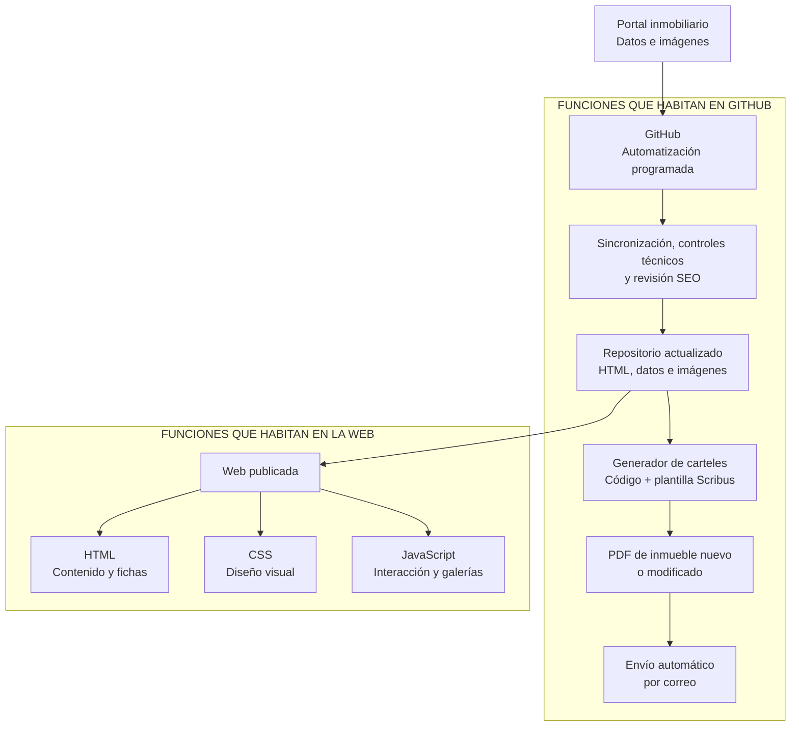

# INMOGL — MAPA DE ARQUITECTURA Y AUTOMATIZACIÓN

## Web, GitHub, Scribus y envío de PDF

**Estado:** arquitectura provisional pendiente de validación completa.  
**Finalidad:** recordar con claridad dónde habita cada función y cómo circula la información desde la actualización de los inmuebles hasta la publicación web y el envío de los carteles.

> Este documento describe la arquitectura objetivo. Que un reloj o proceso aparezca aquí no significa que ya esté activado: su estado real deberá comprobarse en GitHub antes de considerarlo operativo.

## Diagrama general

## Explicación breve

- **Fuente inmobiliaria** — Proporciona los datos y las imágenes que deben reflejarse en InmoGL.

- **GitHub: centro de automatización** — Aloja el repositorio, los procesos programados, las comprobaciones, el generador de carteles y la plantilla Scribus.

- **Actualizaciones programadas** — Arquitectura prevista: sincronización ligera a las **03:17**, revisión técnica a las **03:47** y revisión SEO a las **04:17**. Cada reloj deberá verificarse como realmente activo antes de darlo por configurado.

- **Repositorio actualizado** — Conserva los HTML, las fichas internas, las referencias de los inmuebles y los medios necesarios para la web y los carteles.

- **Web publicada** — Presenta el contenido al visitante mediante **HTML** para la información, **CSS** para el diseño y **JavaScript** para la interacción, galerías y controles visuales.

- **JavaScript de la web** — No genera carteles, no modifica la plantilla Scribus y no envía correos. Solo interviene en el comportamiento visible de la web, salvo que una necesidad técnica futura obligue a ampliar los datos disponibles.

- **SEO** — La revisión SEO habita en la automatización de GitHub y analiza o propone cambios sobre la web. No debe mezclarse con la generación del cartel.

- **Analítica** — Si se activa, la recogida de medición pertenece a la web o al servicio externo correspondiente; su revisión puede programarse desde GitHub. No interviene en Scribus ni en el envío de PDF.

- **Plantilla Scribus** — Habitará como archivo `.sla` dentro de los recursos de automatización del repositorio, no dentro del HTML. Su ubicación prevista es `automation/carteles/plantillas/`.

- **Generador de carteles** — Habitará en `automation/carteles/` y será código independiente —previsiblemente Python—. Leerá la ficha del inmueble, aplicará las reglas aprobadas y generará una copia rellenada de la plantilla.

- **Separación entre reglas y código** — Las reglas `.md` explican y limitan el comportamiento; el generador es el código que lo ejecuta. Las reglas por sí solas no producen ningún cartel.

- **Inmuebles nuevos o modificados** — Después de la sincronización, el sistema identificará los inmuebles que requieran cartel y generará únicamente sus salidas correspondientes.

- **Generación del PDF** — El generador rellenará los campos permitidos, encuadrará las dos fotografías, conservará intacta la geometría del maestro y exportará el resultado a PDF mediante Scribus.

- **Envío por correo** — GitHub enviará el PDF a la dirección autorizada. Las credenciales necesarias deberán guardarse como secretos de GitHub y nunca dentro del HTML, JavaScript o repositorio público.

- **Salida de la web y salida de carteles** — La misma actualización alimenta dos resultados distintos: la web publicada para visitantes y el PDF enviado por correo para el escaparate.

## Ubicación prevista de las piezas

| Pieza | Ubicación | Función |
|---|---|---|
| Fichas de inmuebles | `inmuebles/` | Fuente HTML estructurada de cada inmueble. |
| Imágenes y medios | `images/` | Recursos utilizados por la web y, cuando corresponda, por los carteles. |
| HTML, CSS y JavaScript | Raíz, `styles/` y `JS/` | Presentación y funcionamiento visual de la web. |
| Plantilla Scribus | `automation/carteles/plantillas/` | Maestro visual fijo del cartel. |
| Generador | `automation/carteles/` | Lectura de datos, relleno del `.sla` y generación de PDF. |
| Automatizaciones | `.github/workflows/` | Relojes, sincronización, controles, generación y envío. |
| Reglas del sistema | Carpeta de reglas del BACKUP | Especificación, límites y trazabilidad del funcionamiento. |

## Qué deberá conservar el BACKUP completo

- La web funcional completa.
- Las fichas internas necesarias para reconstruirla.
- Las reglas vigentes y su trazabilidad.
- La plantilla Scribus aprobada.
- El generador de carteles.
- Los workflows de GitHub.
- La configuración documentada del envío de PDF, sin incluir credenciales secretas.
- Una prueba validada que permita comprobar el funcionamiento del conjunto.

## Secuencia de validación pendiente

1. Recibir la plantilla Scribus corregida y bloqueada.
2. Implementar el generador provisional.
3. Repetir la prueba con el inmueble `107727313`.
4. Validar visualmente el `.sla` y el PDF.
5. Integrar la generación automática y el envío por correo.
6. Comprobar el funcionamiento real de los relojes y workflows.
7. Actualizar los tres ZIP: BACKUP completo, WEB provisional completa y ZIP mínimo para PC.
8. Elevar a permanentes únicamente las reglas que hayan quedado verificadas.

